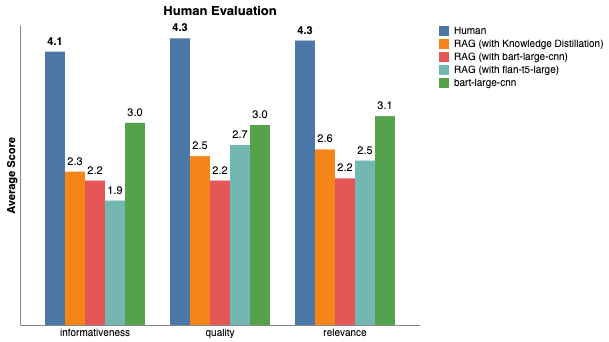

# YouTube Video Summarization via Knowledge Distillation and RAG

## Project Overview

This repository hosts the implementation of a scalable AI system designed to generate abstractive summaries for YouTube video transcripts. Addressing the challenges of processing long-form unstructured audio-visual data, this project employs a **Knowledge Distillation** framework. We utilize a high-capacity Large Language Model (Gemini 2.0Flash) to generate a synthetic "Gold Standard" dataset, which is subsequently used to fine-tune a computationally efficient **Flan-T5** model.

The system integrates principles from **Retrieval-Augmented Generation (RAG)** for context management and demonstrates a viable pipeline for democratizing video intelligence with low inference costs.

## Demonstration

### 1. APP (TBA)
...
...
...

### 2. Interactive Model Demo

In addition to the app application, we deployed a dedicated web-based demonstration on [Hugging Face Spaces](https://huggingface.co/spaces/ying2sun/youtube-video-summarizer-capstone). This demo lets users interact directly with our fine-tuned Flan-T5 model by either selecting pre-configured YouTube demo videos (with stored transcripts) or pasting their own video transcripts. The deployment shows that high-quality, abstractive video summarization can be run efficiently on standard CPU-only hardware, without relying on paid external APIs at inference time.


## Technical Objectives

1.  **Abstractive Summarization:** Move beyond extractive methods to generate coherent, synthesized paragraphs that capture the core narrative.
2.  **Cost Efficiency:** Replace reliance on continuous, expensive API calls to proprietary LLMs with a fine-tuned, locally deployable Small Language Model (SLM).
3.  **Data Engineering:** Overcome the lack of labeled training data through the engineering of a synthetic dataset generation pipeline.

## Repository Structure

The project directory is organized as follows:

* **src/**: Contains the production-ready source code for the inference engine and the `VideoSummarizer` class.
* **notebooks/**: Documentation of the experimental process, analysis, and legacy comparisons.
    * `final_analysis_and_plots.ipynb`: The primary notebook containing the reproducible pipeline for model training, inference, quantitative evaluation (ROUGE/Cosine Similarity), and generation of final report visualizations.
    * `human_evaluation.ipynb`: Contains the qualitative assessment protocols and results from human-in-the-loop testing.
    * `legacy_rag_experiment.ipynb`: Records the initial 'RAG Prototype' approach using Retrieval-Augmented Generation (RAG), preserved for architectural comparison.
    * `appendix_model_benchmarking.ipynb`: A comparative analysis notebook benchmarking the local Flan-T5 model against cloud-based LLMs (via OpenRouter) to assess performance trade-offs.
    * `fix_notebook.py`: Utility script for notebook maintenance and formatting.
* **data/**: The derived dataset (`gold_dataset_merged_final.csv`) is included. Also, the human_evaluation_sample - `human_evaluation_sample.csv` is included, which is for the human evaluation part of the project.
* **app/**: Lists all files for api calls and the application.
* **reports/**: Contains the final project report detailing the methodology, error analysis, and conclusions.
* **images/**: Stores data visualizations generated during the evaluation phase, such as performance metrics and embedding comparisons.
* **requirements.txt**: Lists all Python dependencies required to reproduce the environment.

## Methodology

The development process followed a four-stage pipeline:

1.  **Data Acquisition & Preprocessing:**
    Utilization of the `jamescalam/youtube-transcriptions` dataset. The pipeline handles text cleaning, concatenation based on video IDs, and tokenization.

2.  **RAG Prototype:**
    Initial implementation using FAISS vector stores and `sentence-transformers` to retrieve relevant transcript chunks. While effective for QA, this approach highlighted limitations in global narrative summarization, prompting a shift to fine-tuning.

3.  **Knowledge Distillation:**
    Deployment of a robust data pipeline to interact with the Gemini API, generating approximately 300 high-quality summary-transcript pairs. This synthetic dataset served as the ground truth for student model training.

4.  **Supervised Fine-Tuning:**
    Fine-tuning of the `google/flan-t5-base` model using the generated dataset. Training employed mixed-precision (FP16) and optimized hyperparameters to ensure convergence within limited GPU resources.

5.  **Model Deployment:**
    Deployment of the fine-tuned model as an interactive web application using Hugging Face Spaces and Gradio. This supports real-time inference on user-provided video transcripts and a small set of pre-loaded YouTube demo videos that emulate the full URL-to-summary workflow. This design removes the need for any local setup, while demonstrating the model's portability, low inference cost, and practical utility on CPU-only infrastructure.

6.  **Comparative Benchmarking:**
    Implementation of a benchmarking framework to evaluate the fine-tuned local model against a state-of-the-art cloud-based Large Language Model (`GPT-OSS-20B` via OpenRouter). This stage quantifies the trade-offs between model size, inference cost, data privacy, and semantic accuracy, validating the efficiency of the Small Language Model (SLM) for specific summarization tasks.

    
## Performance Evaluation
### Human Evaluation

Results from the human evaluation can be replicated by running the notebooks/human_evaluation.ipynb notebook. The notebook utilizes the csv located at data/human_evaluation_sample - human_evaluation_sample.csv in the Github repository.



Our group conducted a human evaluation of the six models below.

1. Bart-large-cnn
2. RAG (with bart-large-cnn)
3. RAG (with flan-t5-large)
4. RAG (with Knowledge Distillation)
5. Gpt-oss-20b (via OpenRouter api)
6. Human

To compare how well the six models could summarize, our team randomly sampled 30 YouTube videos to watch. The 30 videos are in the same domain, technical tutorials, and are from the same youtube-transcriptions dataset but not in the training data. Then for each of the 30 videos we wrote a summary of the video. From there we scored the six summaries for each video on informativeness, quality, and relevance. The scores were on a scale of 1 (poor) to 5 (excellent) and their definitions are below.

1. Informativeness: How much important information does the summary convey?
2. Quality: Is the summary clear, well-written, and complete overall?
3. Relevance: Does the summary capture the key points of the video?

In the bar chart we bold the score of the model if it is not statistically significant from the best score at p=0.05, using a bootstrap-based paired mean difference test.

We find that across all three metrics, humans perform the best, especially in terms of quality. Humans achieved a quality score of 4.3 while the gpt-oss-20b, bart-large-cnn model, RAG (with flan-t5-large), RAG (with Knowledge Distillation), and RAG (with bart-large-cnn) model achieved a quality score of 3.7, 3, 2.7, 2.5, and 2.2 respectively. To add, the quality score of humans was not significantly different from the highest quality score (4.3 vs. 4.3), while the quality score of RAG (with bart-large-cnn), RAG (with flan-t5-large), RAG (with Knowledge Distillation), bart-large-cnn, and gpt-oss-20b (2.2 vs. 4.3 and 2.7 vs. 4.3 and 2.5 vs. 4.3 and 3 vs. 4.3 and 3.7 vs. 4.3) were significantly different. Additionally we saw that the bart-large-cnn model performed better than all the RAG models in terms of informativeness, quality, and relevance. In all, across the six models, our human evaluation shows humans to have the best summarization performance.

### Quantitative Evaluation (ROUGE Metrics) 
We evaluated the model using both lexical and semantic metrics:

| Metric | Score / Observation |
| :--- | :--- |
| **ROUGE-1** | **0.2486** (Improved baseline) |
| **ROUGE-2** | **0.0503** |
| **Semantic Similarity** | **0.5966** (Strong conceptual understanding) |
| **Inference Speed** | < 5 seconds per video (on GPU) |

## Execution Instructions

### Prerequisites
* Python 3.8 or higher
* GPU support is recommended for efficient model inference (e.g., NVIDIA CUDA).

### 1. Installation
Clone the repository and install the necessary dependencies listed in `requirements.txt`.

```
git clone https://github.com/sokkerstar123/Capstone.git
cd Capstone
pip install -r requirements.txt
```

### 2. Model Weight Configuration
Due to GitHub's file size limitations, the fine-tuned model weights are hosted externally.
* **Action Required:** Download the model package from [https://drive.google.com/file/d/1Cz60JtJpdVMrFds9RI6-9LgIqQ44rIJo/view?usp=drive_link](https://drive.google.com/file/d/1Cz60JtJpdVMrFds9RI6-9LgIqQ44rIJo/view?usp=drive_link).
* **Setup:** Unzip the downloaded file and ensure the directory `final_flan_t5_model` is placed in the root of this project repository.

### 3. Generating Summaries (Inference)
To run the summarizer on a new video, you can use the provided script in the `src` directory or write a simple Python script as follows:

```
from src.video_summarizer import VideoSummarizer

# Initialize the model
# Ensure 'final_flan_t5_model' exists in your current directory
summarizer = VideoSummarizer(model_path="./final_flan_t5_model")

# Run inference
url = "https://www.youtube.com/watch?v=VIDEO_ID"   # Remember to replace `VIDEO_ID`
summary = summarizer.generate_summary(url)
print(summary)
```

### 4. Reproducing Results and Figures
To reproduce the figures and evaluation metrics found in the final report:
1. Navigate to the `notebooks/` directory.
2. Open `final_analysis_and_plots.ipynb` using Jupyter Notebook or Google Colab. （TBA）
3. Execute the cells sequentially. Note that the training dataset (`gold_dataset_merged_final.csv`) must be present in the correct path as defined in the notebook.


## Data Access Statement

### 1. Source Data
This project utilizes the **YouTube Transcriptions** dataset hosted on Hugging Face.
* **Dataset Name:** `jamescalam/youtube-transcriptions`
* **Access:** Publicly available via the Hugging Face Datasets library.
* **URL:** https://huggingface.co/datasets/jamescalam/youtube-transcriptions
* **Ownership & License:** Data ownership resides with the original content creators on YouTube. This dataset is provided for research/educational purposes under the terms specified by the repository maintainer.

### 2. Derived Data (Synthetic Training Set)
To facilitate knowledge distillation, we generated a synthetic dataset containing "Gold Standard" summaries.
* **Method:** Generated using Google's Gemini 2.0 Pro API based on the source transcripts.
* **Availability:** The derived dataset (`gold_dataset_merged_final.csv`) is included in this repository for reproducibility: [https://github.com/sokkerstar123/Capstone/blob/main/data/gold_dataset_merged_final.csv](https://github.com/sokkerstar123/Capstone/blob/main/data/gold_dataset_merged_final.csv).
* **Terms of Use:** This derived data is intended solely for academic research and verifying the results of this project.

### 3. Model Weights
The fine-tuned model weights (`final_flan_t5_model`) are hosted externally due to file size limitations.
* **Access:** [https://drive.google.com/file/d/1Cz60JtJpdVMrFds9RI6-9LgIqQ44rIJo/view?usp=drive_link](https://drive.google.com/file/d/1Cz60JtJpdVMrFds9RI6-9LgIqQ44rIJo/view?usp=drive_link)
* **License:** The model is a derivative of `google/flan-t5-base` (Apache 2.0 License).

## License and Attribution

### Attribution
* **Open Source Code:** Certain segments of the RAG retrieval logic and text preprocessing were adapted from open-source documentation (e.g., Hugging Face Tutorials, YouTube Transcript API docs). These segments are explicitly marked with in-line attributions within the source code files.
* **AI Assistance:** Generative AI tools (e.g., ChatGPT, Gemini) were utilized during the development process for studying, code debugging, refactoring, and generating documentation strings (docstrings). All AI-generated code was reviewed and verified by the human authors.
* **Synthetic Data:** The "Gold Standard" summaries used for training were synthetically generated using the **Google Gemini API**.

### License
This project is licensed under the **MIT License**.

---
*This project was submitted in partial fulfillment of the requirements for the Master of Applied Data Science (MADS) program.*
